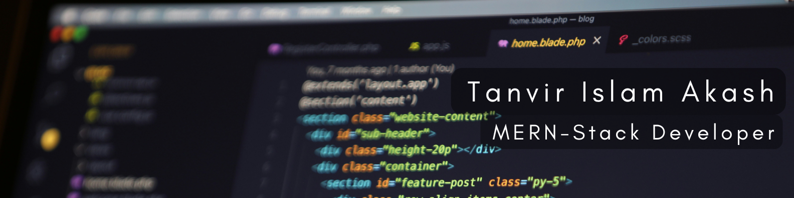

# 💫 About Me:
<ul>
  <li>Hi, I'm <b>Tanvir Islam Akash</b>!</li>
  <li>I'm a <b>MERN stack</b> (MongoDB, Express.js, React, Node.js) <b>web developer</b> with <b>hands-on experience</b> in building full-stack applications.</li>
  <li>I have <b>1 years of hands-on experience</b> in <b>web development</b>, specializing in modern JavaScript frameworks.</li>
  <li>I've successfully <b>completed around 6 projects</b> and am <b>constantly learning</b> new technologies to stay updated.</li>
  <li>I'm <b>proficient</b> in <b>React, Next.js, and MongoDB</b>, with a strong focus on clean, scalable code.</li>
  <li>Currently I'm learning more in <b>Next.js</b> and <b>TypeScript</b>.</li>
</ul>


###  A little more about me...  


```javascript
const tanvir_islam_akash = {
    pronouns: "He" | "Him",
    code: ["PHP", "Javascript", "Python"],
    askMeAbout: ["web desigh", "web dev", "UI/UX"],
    technologies: {
        frontEnd: {
            js: ["React", "Next.js", "TypeScript"],
            css: ["Tailwind", "DaisyUI", "Bootstrap"],
        },
        backEnd: {
            js: ["Node", "Express", "MongoDB"],
        },
        databases: ["MongoDB", "MySQL"],
        generativeAI: ["GPT", "Claude AI", "DeepSeek"],
    },
    architecture: {
        databases: ["MongoDB", "MySQL"],
    },
    currentFocus: "AI-driven code learning, mastering new technologies, and practical implementation",
    funFact: "I debug faster when I listen to music 😊"
};
```
  


## 🌐 Socials:
[](https://facebook.com/tanvirislamakash2002) [](https://www.linkedin.com/in/tanvir-islam-akash2002)

# 💻 Tech Stack:
                   

# 📊 GitHub Stats:
 <br/>
<br/>


---
[](https://visitcount.itsvg.in)


<!-- Proudly created with GPRM ( https://gprm.itsvg.in ) -->
