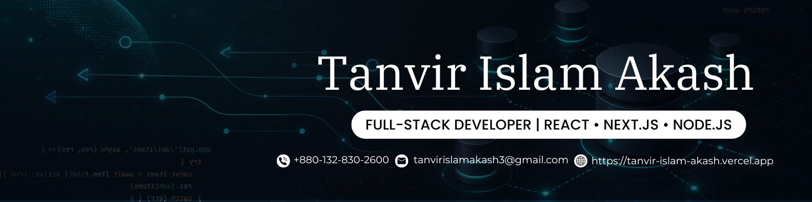

# 💫 <h2>About Me:</h2>
<ul>
  <li>Hi, I'm <b>Tanvir Islam Akash</b>! 👋</li>
  <li>I'm a <b>Full-Stack Web Developer</b> currently working as a <b>Backend Developer</b> at <b>Tomkulak Consortium</b>.</li>
  <li>I specialize in the <b>MERN stack</b> (MongoDB, Express.js, React, Node.js) with <b>1+ years of hands-on experience</b> building full-stack applications.</li>
  <li>I've successfully <b>completed 6 projects</b> and am <b>constantly learning</b> new technologies to stay updated.</li>
  <li>I'm <b>proficient</b> in <b>Next.js, Python, MySQL and PostgreSQL</b>, with a strong focus on clean, scalable code.</li>
</ul>

## 💼 Professional Experience

### Data Engineer / Backend Developer
**Tomkulak Consortium** | *Present*

**Critical Infrastructure Data Ingestion Pipeline**
- Developed a data ingestion pipeline serving **21 critical infrastructure sectors** (energy, water, transportation, etc.) using **Python, PostgreSQL, and PostGIS**.
- Implemented robust **ETL processes** to read GIS data (shapefiles/GeoPackages), transform geometries (CRS reprojection, fixing invalid geometries), and load into a spatial database.
- **Containerized** the entire application using **Docker**, ensuring consistent environments for development, testing, and production.
- Built a **CLI tool** enabling flexible ingestion workflows - single sector, batch processing, or full pipeline execution.
- Created **YAML-based configuration files** for each sector, allowing easy scalability and maintenance without code changes.

**Tech Stack:** `Python` • `PostgreSQL` • `PostGIS` • `Docker` • `GIS` • `ETL` • `CLI Development`

---

###  A little more about me...  


```javascript
const tanvir_islam_akash = {
    pronouns: "He" | "Him",
    code: ["PHP", "Javascript", "Python"],
    askMeAbout: ["web design", "web development", "UI/UX"],
    technologies: {
        frontEnd: {
            js: ["React", "Next.js", "TypeScript"],
            css: ["Shadcn", "Tailwind", "DaisyUI", "Bootstrap"],
        },
        backEnd: {
            js: ["Node.js", "Express.js"],
            python: ["Python"],
        },
        databases: ["MongoDB", "PostgreSQL", "MySQL"],
        generativeAI: ["GPT", "Claude AI", "DeepSeek"],
        },
    architecture: {
        frontend: ["SPA (Single Page Application)", "Component-based UI"],
        backend: ["REST APIs", "MVC pattern", "Server-side logic separation"],
        databaseDesign: ["Relational", "NoSQL", "Indexing basics"]
       },
    currentFocus: "AI-driven code learning, mastering new technologies, and practical implementation",
    funFact: "I debug faster when I listen to music 😊"
};
```
  


## 🌐 Socials:
[](https://facebook.com/tanvirislamakash2002) [](https://www.linkedin.com/in/tanvir-islam-akash2002)

# 💻 Tech Stack:
                          

# 📊 GitHub Stats:
<br/>

[](https://git.io/streak-stats)<br/>


---
[](https://visitcount.itsvg.in)


<!-- Proudly created with GPRM ( https://gprm.itsvg.in ) -->
